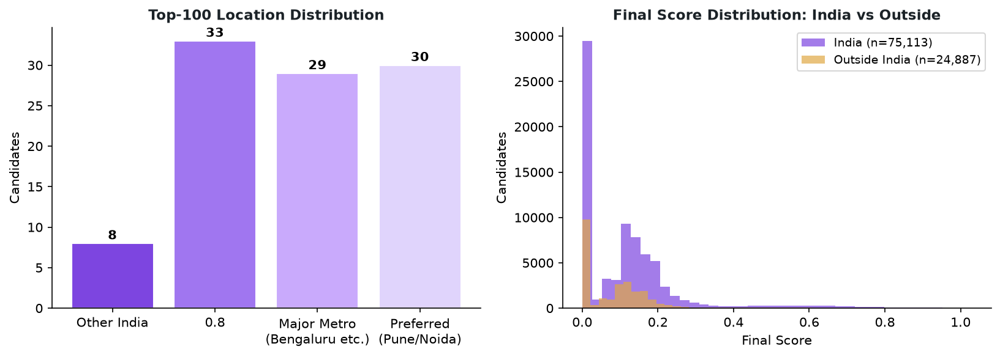

# Fairness & Neutrality Audit

This document audits the ranking system for systematic bias on dimensions that are not
legitimate job requirements.

## Candidate Name Anonymization

All candidate names in the Redrob dataset are anonymized. The ranker never receives name,
age, or gender data. No demographic inference is performed at any stage.

## Location Fairness

The JD explicitly requires Pune/Noida and allows India-wide candidates. Location is applied
as a **modifier** (multiplier in range [0.82, 1.04]),
never as a hard disqualifier.

| Group | Pool size | Top-100 |
|---|---|---|
| India-based | 75,113 | 100 |
| Outside India | 24,887 | 0 |

**Design principle:** A non-India candidate with exceptional ML engineering fit can still
rank in the top-100. The location modifier nudges preference per the JD without vetoing
strong fits.

## Behavioral Signal Neutrality

All 23 Redrob behavioral signals are used only in the availability modifier
(clamped [0.87, 1.05]).

**Sentinel handling:** When any signal is missing (value = −1 or 0 with 0 applications),
it is treated as NEUTRAL, contributing 0.5 to that sub-component rather than a penalty.
Verified in `tests/test_adversarial.py::test_sentinel_not_penalized`.

This means a candidate who has never used the Redrob platform is not penalized — their
fit score is determined entirely by their profile, career history, and skills.

## Honeypot Detection Bias

Our consistency checker flags candidates with statistically impossible timelines (stated
YOE > career span + education buffer). This is a **data-quality** check on the profile
itself, not a judgment about any group characteristic.

- Detection is based on arithmetic (start/end dates vs claimed YOE), not demographics.
- False positive rate was reduced by adding an education-supports guard (if earliest
  graduation year implies sufficient time, the candidate is NOT flagged).
- See `src/features/consistency.py` for the exact logic.

## Limitations

1. We cannot audit for **indirect bias** without demographic ground truth (which the
   anonymized dataset does not provide).
2. Location within India: all "Other India" cities receive the same modifier (0.65),
   which doesn't distinguish tier-2 city sizes. This is a known simplification.
3. The LLM-judge labels used for training may carry biases from the LLM providers
   themselves — we cannot fully audit the label generation process.
