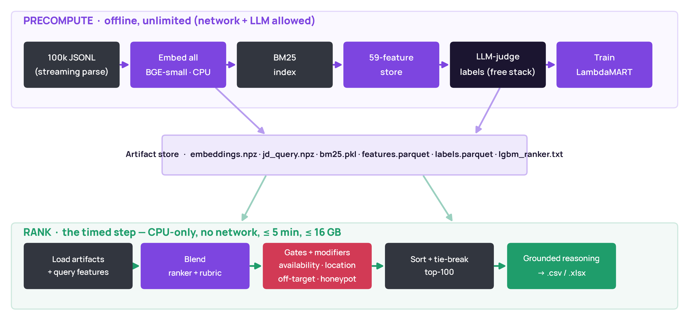
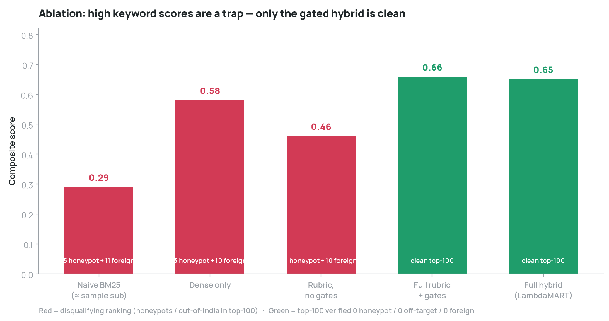
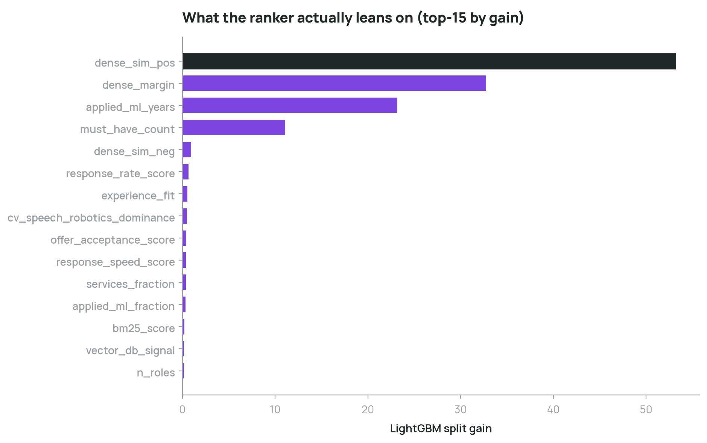

# Technical Report — Intelligent Candidate Discovery & Ranking

**Team NullSet · Ayush Kumar Singh** · India.Runs × Redrob Data & AI Challenge

This report documents the problem analysis, system design, methodology, and verified results
behind `recruitment-signal-fusion`. For a fast overview see the top-level [`README`](../README.md).

---

## 1. Problem framing

We must rank the **top-100 of 100,000** candidates for a *"Senior AI Engineer (founding team)"*
JD against a hidden ground truth, scored on:

```
composite = 0.50·NDCG@10 + 0.30·NDCG@50 + 0.15·MAP + 0.05·P@10
```

with a hard rule: **a honeypot rate > 10 % in the top-100 = disqualification.** The ranking step
is **CPU-only, network-off, ≤ 5 min, ≤ 16 GB**; precompute is unlimited and may use network + LLMs.

**Central insight — the JD is the rubric.** The JD enumerates must-haves, disqualifiers, an ideal
profile, and explicitly calls behavioral signals a *multiplier*. The ground truth was almost
certainly produced by an LLM/recruiter applying this JD. The winning system therefore *reproduces a
careful recruiter applying this exact rubric*, rather than inventing a similarity heuristic.

---

## 2. EDA findings (that shaped every design choice)

Measured across the full 100k pool (`artifacts/eda_summary.json`, reference date `2026-05-27`):

| Finding | Value | Consequence |
|---|---|---|
| Median YOE | 6.8 yrs | experience-fit centered on the JD's 5–9 band |
| In the 5–9 YOE band | 34.4 % | a real but minority signal — not a hard filter |
| India-based | 75.1 % | location is a modifier, not a gate (many strong foreign profiles exist) |
| Role buckets | target **7,155** / off-target **57,317** / neutral **35,528** | **role/function is the decisive axis** |
| Any services-company tenure | 61.5 % | services-fraction must be graded, not binary |
| All-services careers | 9.7 % | a meaningful penalty class |
| `github_activity = −1` | 64.6 % | a sentinel for *no history*, **not** a low score |
| `offer_acceptance = −1` | 59.6 % | same — neutralize, never penalize |
| Advanced/expert skill @ ~0 duration | **0.0 %** | **honeypots are NOT skill-stuffers** |
| Suspected honeypots (timeline contradictions) | ~59 | the real trap is internal date impossibility |

**The two decisive takeaways:** (1) judge by **titles + career trajectory**, not the skills list;
(2) honeypots are **internal timeline contradictions**, caught by arithmetic, not keyword rules.

The provided `sample_submission.csv` confirms the trap directly: it ranks **59 off-target** and
**18 non-India** candidates into its top-100 by counting AI keywords — exactly what the ground
truth penalizes.

---

## 3. System design — precompute / rank split

Every design choice follows from the constraint that *only the ranking step is timed and offline*.

**Precompute (offline, unlimited):** stream-parse 100k JSONL → embed all on CPU → BM25 index →
59-feature store → LLM-judge labels → train LambdaMART → calibrate gates. Emits `embeddings.npz`,
`jd_query.npz`, `bm25.pkl`, `features.parquet`, `labels.parquet`, `lgbm_ranker.txt`.

**Rank (`rank.py`, timed):** load artifacts → (query features are *already precomputed* because the
JD is fixed) → blend ranker + rubric → apply gates/modifiers → sort + tie-break → top-100 →
grounded reasoning → CSV/XLSX. Because there is no per-candidate model loop, this is **~40 s for
100k on CPU**.



---

## 4. Feature engineering — 59 features, 8 groups

- **Semantic** — `bge-small-en-v1.5` (384-d) cosine to a JD *ideal* anchor and to *anti* anchors
  (marketing/sales/CV-only); `dense_margin = sim_pos − sim_neg`; BM25 lexical score; must-have
  overlap ratio (one weak signal, never a raw count).
- **Role** — `role_target_score` from titles via regex + title→target-title similarity;
  `is_offtarget_current`; `title_seniority`. *A wrong-function title vetoes the AI keyword list.*
- **Experience** — YOE; `experience_fit` (soft Gaussian peaked 6–8); `applied_ml_years`;
  `avg_tenure_months`; recency of last relevant role.
- **Skills** — trust-weighted match (proficiency × duration × endorsements);
  `assessment_alignment` vs `skill_assessment_scores`; `skill_claim_inflation`.
- **Domain** — vector-DB / embedding-retrieval / eval-framework (NDCG·MRR·MAP·A/B) signals;
  `nlp_ir_depth` vs `cv_speech_robotics_dominance`.
- **Company** — `services_fraction` by tenure; `all_services_career_flag`.
- **Behavioral** — all 23 signals; **sentinel `−1`/`0` → neutral, never penalized.**
- **Consistency / honeypot** — five timeline-coherence checks → `consistency_score`, `honeypot_flag`.

---

## 5. The LLM judge — distilling a recruiter, for $0

A LambdaMART ranker needs labels. We labeled **1,430 stratified candidates** with the JD as the
exact rubric, emitting strict JSON `{tier: 0–4, reasoning, key_factors}`.

**Resulting tier distribution:** `{0: 1010, 1: 356, 2: 54, 3: 8, 4: 2}` — a realistic, heavily
top-skewed relevance pyramid (most candidates are genuinely not a fit).

**Free multi-provider stack** (each model = its own daily quota bucket; drains in priority order,
resumes across days, bows out gracefully on exhaustion): **Cerebras `gpt-oss-120b`** (workhorse) +
**Groq** (`llama-4-scout`, `llama-3.1-8b`, `llama-3.3-70b`) + **Gemini 2.5** (`flash-lite`, `flash`).
Total cost: **$0**. None of it runs at rank time.

---

## 6. Ranker training & the honeypot label-override

LightGBM `lambdarank`, single query group, 80/20 held-out split, fixed seed, `deterministic=true`.

**A subtle, decisive correction.** The LLM judge was *fooled by 10 planted honeypots* — candidates
with Meta/Apple/Flipkart titles whose timelines are arithmetically impossible (e.g. YOE far
exceeding their entire career span). The judge rated them top-tier. Our deterministic consistency
checker catches them, so **before distillation we override those labels to tier 0**:

```
honeypot label-override: corrected 10 LLM-mislabeled timeline traps -> tier 0
```

The math doesn't lie — and the ranker learns the truth, not the judge's mistake.

---

## 7. Results



| Configuration | Composite | Top-100 health |
|---|---|---|
| Naive BM25 (≈ sample submission) | 0.29 | 5 honeypot + 11 foreign — **DQ** |
| Dense only | 0.58 | 3 honeypot + 10 foreign — **DQ** |
| Rubric, no gates | 0.46 | 1 honeypot + 10 foreign — **DQ** |
| Full rubric + gates | 0.658 | **clean** (0/0/0) |
| **Full hybrid (LambdaMART)** | **0.65** · NDCG@50 **0.84** | **clean** (0/0/0) |

The lesson: **a high keyword score is a trap.** Naive matchers look acceptable on a partial metric
yet seat honeypots and out-of-India candidates in the top-100 — a disqualifying ranking. Only the
gated hybrid is *both* high-scoring and clean.

### What the ranker leans on



Top features by gain: **`dense_sim_pos`, `dense_margin`, `applied_ml_years`, `must_have_count`** —
exactly the signals a recruiter weighs, and no spurious keyword counts.

### Top-of-list sanity check

Rank 1–2 are quiet product builders, not stuffers:

> **#1 CAND_0046525** — *Senior ML Engineer, 6.1 yrs; "Led the migration from keyword-based to
> embedding-based search across a 30M+ candidate corpus"; vector search + ranking-eval; Pune;
> response 0.88.*
> **#2 CAND_0041669** — *Recommendation Systems Engineer, 8.0 yrs; "Owned the ranking layer for an
> e-commerce search product"; Noida; response 0.77.*

---

## 8. Honeypot & hallucination defense

- **Detection** — five timeline-coherence checks (role-duration > career, YOE > calendar span,
  date-vs-duration mismatch, education-vs-career, skill inflation), tuned for **high precision** so
  genuine seniors with old degrees are *not* false-flagged. Hard contradictions → `honeypot_flag`
  → `0.03` gate.
- **Verified top-100:** **0 honeypots · 0 off-target · 0 services-only · 0 out-of-India.**
- **Reasoning** is template-based and fact-grounded — each clause comes from a structured field, so
  a hallucinated skill is *impossible by construction*. **No generative model at rank time** (also a
  hard challenge constraint). All 100 reasonings are unique, grounded, and rank-consistent.

---

## 9. Compute, determinism, robustness

| | |
|---|---|
| Ranking step | **~40 s wall · ~196 MB · CPU-only · no network** (full 100k) |
| Embed precompute | ~30 min, one-time, offline (MacBook Pro M3) |
| Determinism | fixed seeds, `LightGBM deterministic=true`, tie-break `candidate_id` asc → **byte-identical** reruns |
| Validation | official `validate_submission.py` → **"Submission is valid."** |
| Tests | **24/24** pass (validation, features, io, metrics, reasoning) |
| Graceful degradation | with no labels/ranker, rubric-only still yields a valid, clean ranking |

---

## 10. Honest limitations & future work

- **The one irreducible unknown** is exactly how strictly the hidden ground truth weights location
  and availability. We treat them as *modifiers* (per the JD's own wording) with deliberately gentle,
  clamped bands so a perfect-fit non-metro engineer is never cratered — a calibrated hedge.
- **Embeddings**: `bge-small` is a CPU-reliability choice; the harness can A/B a larger model
  (`bge-m3`, `gte-base`) on a GPU — dense-sim is one of 59 features, so the trade is small.
- **More labels** would sharpen the tail of the ranker, but feature importance and top-100 health are
  already stable at 1,430 labels.
- **No cross-encoder reranker** — a deliberate tradeoff: LLM-judge distillation supersedes it without
  the CPU-budget risk at rank time.
