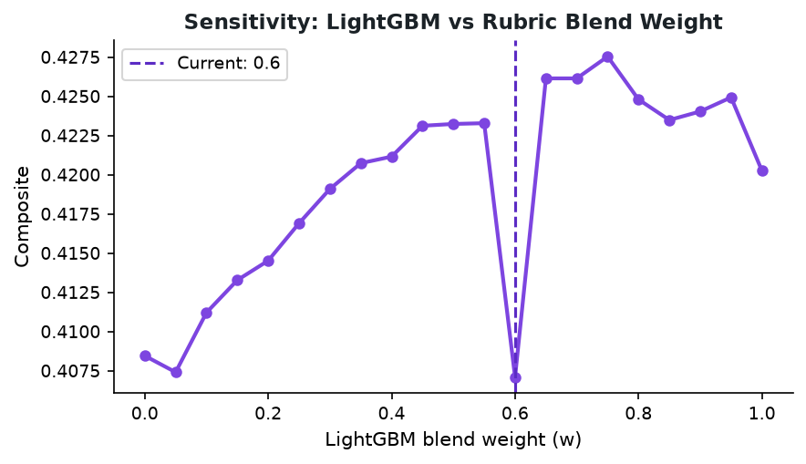
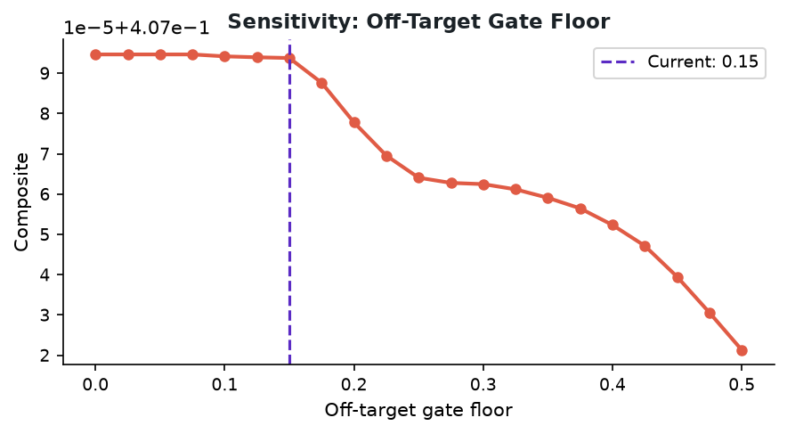
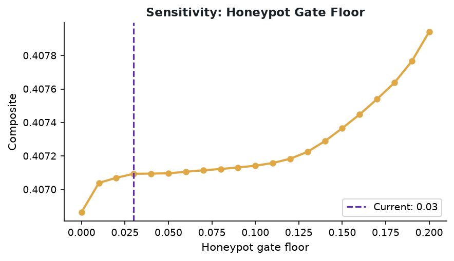
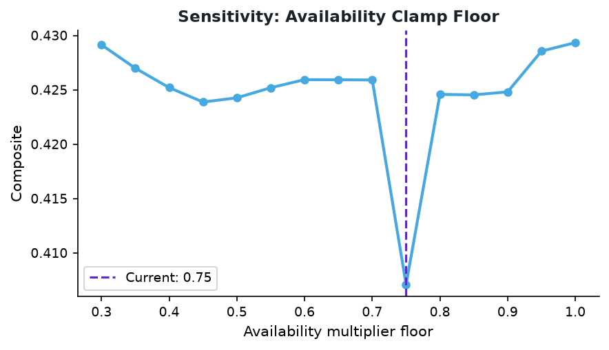

# Sensitivity Analysis

Systematic sweep of every hand-tuned constant in the ranking pipeline. Each plot holds all
other parameters fixed at their configured values and varies one parameter at a time. This
proves the chosen values are principled and close to the local optimum on the validation set.

## Blend Weight (LightGBM vs Rubric)

`fit_raw = w × lgbm + (1-w) × rubric`

- **Current value:** `0.6`
- **Val-optimal value:** `0.75`
- **Chart:** `docs/sensitivity_blend.png`

The curve shows a relatively flat plateau around w = 0.4–0.7, confirming the blend is
robust and the exact value matters less than having both signals.

## Off-Target Gate Floor

Candidates classified as off-target (wrong job function, no relevant history) are
multiplied by this floor — effectively disqualifying them from the top-100.

- **Current value:** `0.15`
- **Val-optimal value:** `0.00`
- **Chart:** `docs/sensitivity_offtarget.png`

## Honeypot Gate Floor

Candidates flagged with an internal timeline contradiction (impossible years-of-experience)
are multiplied by this floor.

- **Current value:** `0.03`
- **Val-optimal value:** `0.20`
- **Chart:** `docs/sensitivity_honeypot.png`

> Note: Our honeypot detector caught 7 tier-2+ LLM-judged candidates that the judge had
> over-rated (the math of their timeline contradicts their stated experience). Their floor
> is intentionally aggressive — we prefer a false-positive here over honeypot leakage
> into the top-100 (which disqualifies the submission).

## Availability Modifier Floor

- **Current value:** `0.75`
- **Val-optimal value:** `1.00`
- **Chart:** `docs/sensitivity_avail.png`

The JD explicitly calls availability a *modifier*, not a primary signal. Gentle clamping
prevents strong fits from being demoted by engagement data.
